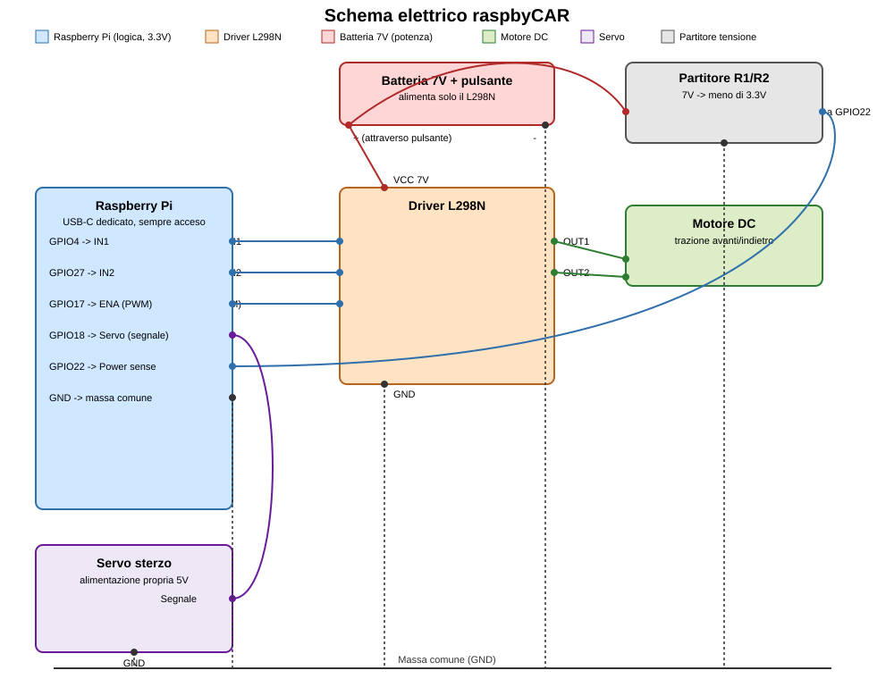

# raspbyCAR
RC robotic car built with a Raspberry Pi and various modules

## Struttura del progetto

```
main.py                          # unico file da eseguire
pyproject.toml                   # rende il package installabile (src layout)
systemd/raspbycar.service        # unit per l'avvio automatico al boot
src/raspbycar/
  config.py                      # pin GPIO e parametri regolabili
  bluetooth_controller.py        # lettura input dal gamepad Bluetooth (evdev)
  dc_motor.py                    # motore di trazione: avanti/indietro
  steering_motor.py               # servo per lo sterzo: destra/sinistra
  power_monitor.py                # rileva se il L298N è alimentato
  car.py                         # orchestrazione: unisce controller + motori
```

## Setup

```bash
python3 -m venv .venv
source .venv/bin/activate
pip install -e .
```

Accoppia il gamepad via `bluetoothctl` prima di eseguire il programma, poi
adatta i pin GPIO in `src/raspbycar/config.py` al tuo cablaggio.

## Sicurezza alimentazione L298N

Il software resta in attesa (senza pilotare motore/sterzo) finché il pin
`L298N_POWER_SENSE_PIN` non risulta alimentato. **Non collegare i 7V della
batteria direttamente al GPIO**: usa un partitore di tensione o un
optoisolatore per portare il segnale a un livello sicuro (max 3.3V).

## Schema elettrico

Basato sui pin BCM definiti in `src/raspbycar/config.py`. Il Raspberry Pi è
alimentato a parte (USB-C, sempre acceso); solo il L298N riceve i 7V della
batteria tramite il pulsante esterno.



Note:
- **GND in comune** tra Raspberry Pi, L298N e servo: obbligatorio perché i
  segnali logici (IN1/IN2/ENA/servo/power-sense) abbiano un riferimento
  comune.
- **Partitore R1/R2**: dimensiona i valori in modo che la tensione su GPIO22
  resti sotto i 3.3V (es. R1 = 4.7kΩ verso i 7V, R2 = 3.3kΩ verso GND →
  circa 2.9V in uscita). In alternativa usa un optoisolatore.
- **Alimentazione servo**: verifica che la tua alimentazione (5V da BEC
  esterno o da un pin 5V del Pi) regga la corrente richiesta dal servo;
  il segnale PWM arriva comunque da GPIO18.
- **Gamepad Bluetooth**: nessun collegamento via cavo, si accoppia in
  radio con il Bluetooth integrato del Raspberry Pi (`bluetoothctl`).

## Avvio automatico al boot


```bash
sudo cp systemd/raspbycar.service /etc/systemd/system/
sudo systemctl daemon-reload
sudo systemctl enable --now raspbycar.service
```

Adatta `User` e i percorsi in `systemd/raspbycar.service` al tuo utente/directory.
Log del servizio: `journalctl -u raspbycar -f`.

## Esecuzione

```bash
python3 main.py
```


